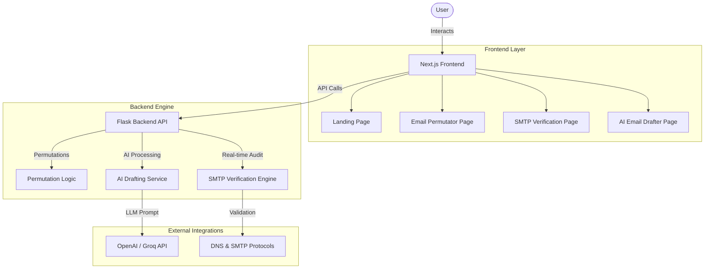

# CodeForage | Premium Outreach Suite

CodeForage is a high-performance, tech-forward outreach platform designed for professionals. It combines lead research, email permutation, SMTP verification, and AI-powered drafting into a single, cohesive "Obsidian Protocol" aesthetic.

## 📁 Repository Structure

```text
Codeforage/
├── frontend/          # Next.js 16 + Tailwind 4 (UI/UX)
├── backend/           # Flask + Python (API / Logic Services)
├── Task.md            # Future roadmap and implemented ideas
└── README.md          # Project overview (this file)
```

## 🏗️ System Architecture



## ✨ Core Features

- **SMTP Verification**: Real-time technical audits for single email addresses using SMTP protocols.
- **Email Permutator**: Generates and verifies email variations at scale for bulk outreach.
- **AI Email Drafter**: Context-aware cold email generation using PDF resumes and custom prompts (GPT-4o/Llama-3).
- **Premium UI/UX**: A glassmorphic, responsive interface built for speed and visual excellence.

## 🛠️ Technology Stack

### Frontend
- **Framework**: Next.js 16 (App Router)
- **Styling**: Tailwind CSS 4 & Vanilla CSS
- **Animations**: Framer Motion
- **Icons**: Lucide React

### Backend
- **Framework**: Flask (Python)
- **AI Integration**: LangChain (OpenAI & Groq)
- **Services**: SMTP Verification, PDF Processing, Permutation Engine

## 🚀 Getting Started

### 1. Prerequisites
- Node.js (v18+)
- Python (3.10+)

### 2. Backend Setup
```bash
cd backend
python -m venv .venv
source .venv/bin/activate  # Windows: .venv\Scripts\activate
pip install -r requirements.txt
python run.py
```

### 3. Frontend Setup
```bash
cd frontend
npm install
npm run dev
```

## 📜 Documentation
- [Frontend Documentation](frontend/README.md)
- [Backend Documentation](backend/README.md)

---
*Built with precision for the modern outreach expert.*\
***By Codeforage Team***
